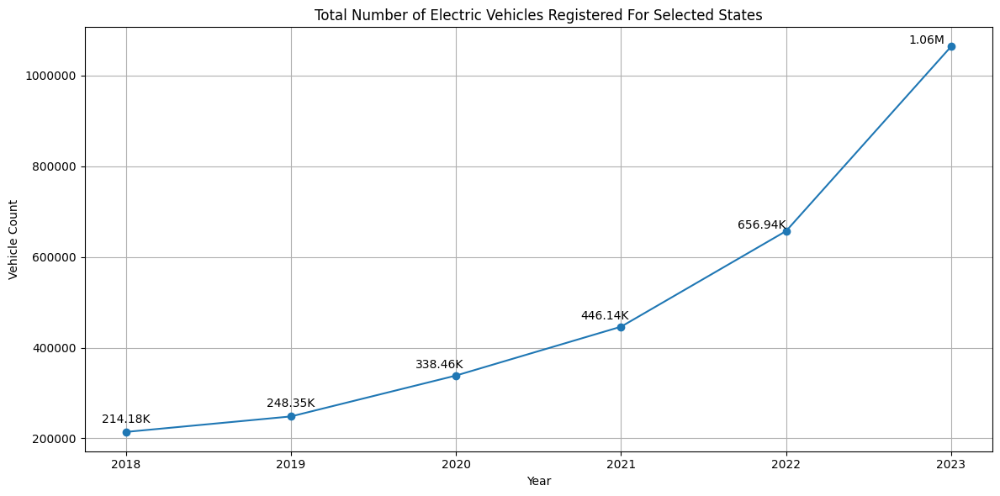
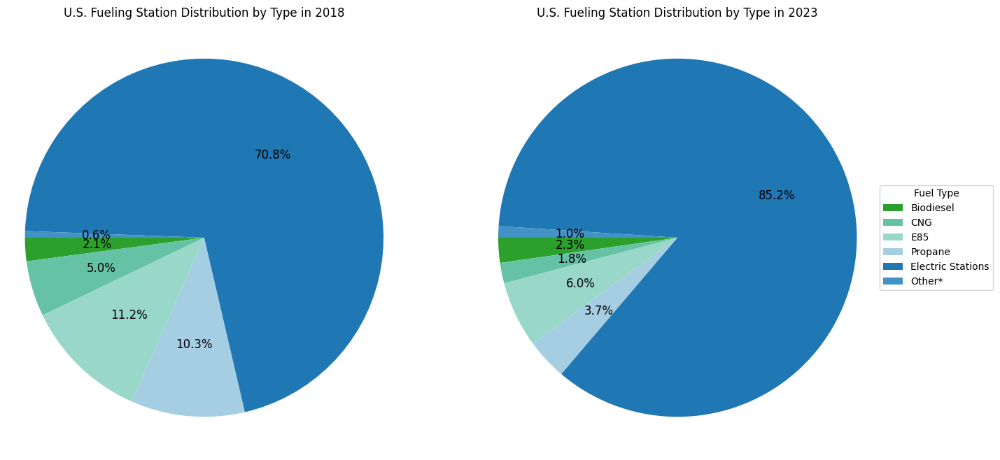
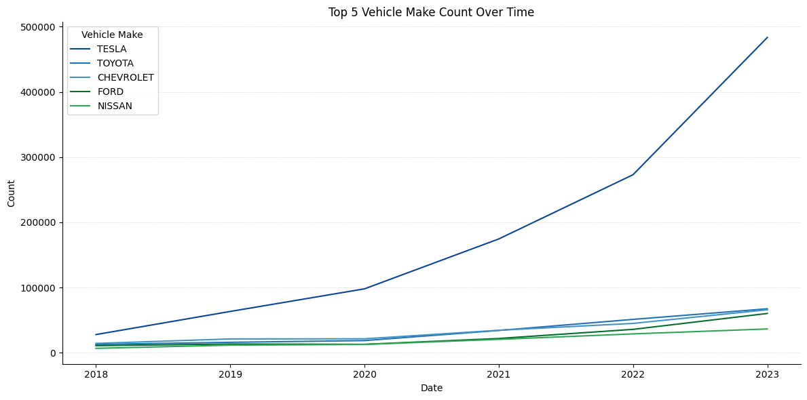
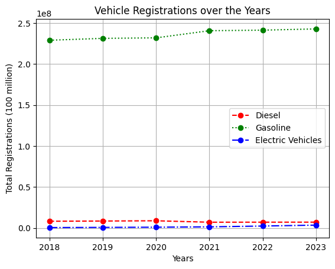
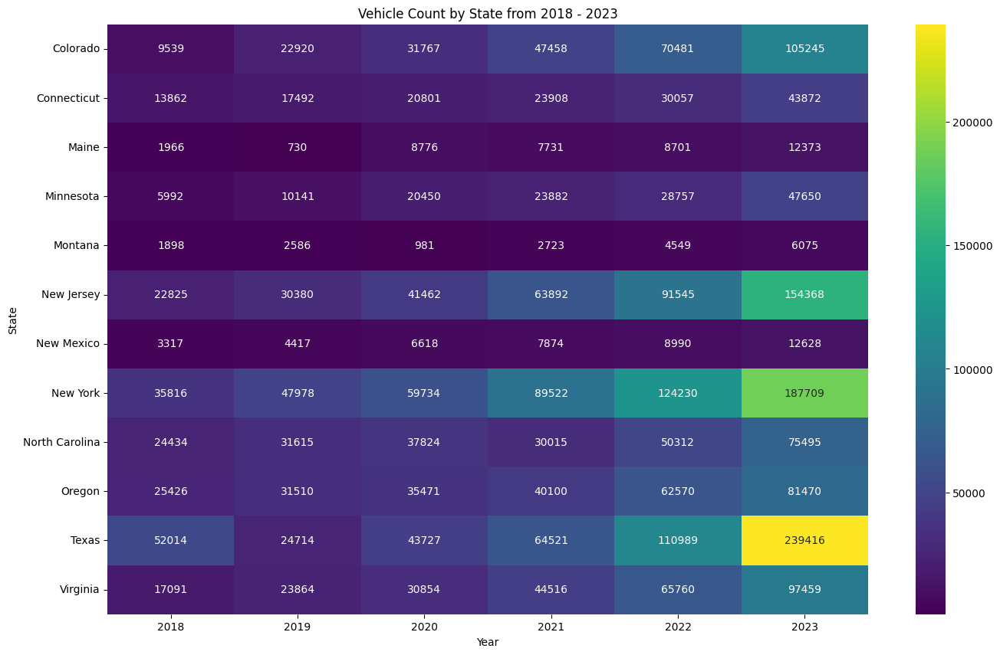

# ⚡ Historical EV Market Growth Analysis in the USA

**How has the U.S. electric-vehicle market grown from 2018 to 2023 — and is the charging
infrastructure keeping up?** An end-to-end exploratory data analysis of EV registrations, charging
stations, brands, and state-level adoption.




---

## Overview

Nearly 14 million new electric cars were registered globally in 2023, yet the U.S. market is still
early in its transition. This project analyzes **U.S. EV market growth from 2018 to 2023** —
spanning the pre- and post-COVID period — using state vehicle-registration data and the Department
of Energy's alternative-fueling-station database. The goal: give stakeholders (automakers, planners,
buyers) a clear read on where EV adoption is strongest, which brands lead, and whether charging
infrastructure is scaling to meet demand.

## What the analysis covers

| Theme | Questions explored |
|-------|--------------------|
| 📈 **Adoption growth** | How fast are EV registrations rising nationally and by state? |
| 🔌 **Charging infrastructure** | How many stations exist, how fast are they added, and how do fuel types compare? |
| 🏆 **State & brand leaders** | Why does California dominate, and how did Tesla capture the market? |
| ⚖️ **Infrastructure vs. demand** | Are stations keeping pace with the surge in registered EVs? |

## Key findings

- **EVs now dominate alternative fueling** — electric stations grew from **~71% to ~85%** of all
  U.S. alternative-fuel stations between 2018 and 2023.
- **California is the outlier** — it accounts for roughly **30% of the U.S. EV market** and EV-station
  network over the period.
- **Tesla owns the brand race** — **> 50%** of registered EVs across the studied states, and still
  pulling away from Toyota, Chevrolet, and Ford.
- **A 2020 → 2021 infrastructure spike** — national EV-station growth jumped to **~137%** that year,
  after averaging ~4.5% annually.
- **Demand is outrunning infrastructure** — EV registrations grow *exponentially* while gasoline and
  diesel stay flat, and charging-station growth trails registration growth in most states.

## Visual highlights

| Fueling-station mix (2018 vs 2023) | Top EV brands over time |
|---|---|
|  |  |

| EV vs. gasoline vs. diesel registrations | Vehicle count by state (heatmap) |
|---|---|
|  |  |

## 🙋‍♀️ My contributions (Yashna Meher)

Within this six-person team project, I owned the **infrastructure-adequacy** thread of the analysis:

- **EV-station density ("cars per station")** — measured how many EVs each charging station must
  serve by state and year, surfacing where infrastructure lags demand (a key metric since EVs take
  ~5× longer to refuel than gas vehicles).
- **EV vs. gasoline/diesel comparison** — quantified how EV registration growth stacks up against
  conventional fuels, showing EV's exponential curve against flat gasoline/diesel.
- **Area-normalized station density** — ranked states by charging stations per square mile to gauge
  real-world convenience of driving an EV.

I also authored the **[supplementary analysis notebook](EV-Market-Supplementary-Analysis.ipynb)**
below, which extends the team's work with per-capita and market-share lenses.

## 🔬 Supplementary analysis (new & fully reproducible)

The original team notebook loaded cleaned data from a private course cloud bucket, so it can't be
re-run outside the class. I built **[`EV-Market-Supplementary-Analysis.ipynb`](EV-Market-Supplementary-Analysis.ipynb)**
to be **fully self-contained** — every chart runs on the public CSVs in [`data/`](data/) — and to
answer four questions the original didn't:

1. **Adoption per capita** — normalizing by population reveals Washington, Hawaii, Colorado, and
   Oregon as deep-penetration leaders (Florida and Texas fall out of the top tier).
2. **EV share of the fleet** — even leading states sit below ~3.5% EV share in 2023, but multiplied
   their share several times over since 2018.
3. **Gas price vs. adoption** — annual gas prices and national EV registrations move together
   (r ≈ 0.79).
4. **Fastest-growing states & fuel-mix shift** — smaller-base states (Michigan, South Carolina, New
   Jersey) compound at 55–65%/yr, and the electrified share of registrations roughly doubled.

## Data sources

| Dataset | Source |
|---------|--------|
| Alternative fueling stations by state | [U.S. DOE — Alternative Fuels Data Center](https://afdc.energy.gov/stations/states) |
| State EV registration data | [Atlas EV Hub](https://www.atlasevhub.com/materials/state-ev-registration-data/) |
| State vehicle registrations by fuel type | [U.S. DOE / FHWA](https://afdc.energy.gov/vehicle-registration) |
| Retail gasoline prices | [U.S. Energy Information Administration](https://www.eia.gov/petroleum/gasdiesel/) |
| State population estimates | [U.S. Census Bureau](https://www.census.gov/programs-surveys/popest.html) |

## Repository structure

```
├── EV-Market-Growth-Analysis.ipynb          # Main team analysis (15 business questions)
├── EV-Market-Supplementary-Analysis.ipynb   # New, reproducible extension (per-capita, market share)
├── EV-Market-Growth-Analysis.pptx           # Final presentation deck
├── Project-Proposal.md                       # Original project proposal
├── Generative-AI-Disclosure.md               # AI-usage disclosure
├── requirements.txt
├── data/                                     # Public CSVs used by the supplementary notebook
└── images/                                   # Charts rendered for this README
```

## How to run

```bash
git clone https://github.com/yashnamb/EV-Growth-Market_analysis.git
cd EV-Growth-Market_analysis
pip install -r requirements.txt
jupyter notebook EV-Market-Supplementary-Analysis.ipynb
```

> **Note:** the main team notebook is included for reference but reads from a private course cloud
> bucket, so it is not runnable as-is. The supplementary notebook is the fully reproducible piece.

## Tech stack

`Python` · `pandas` · `NumPy` · `Matplotlib` · `seaborn` · `Plotly` · `scikit-learn` (linear
regression) · `Jupyter` · `Google Cloud Storage` (original data pipeline)

## Team & credits

A team project for **BA780: Introduction to Data Analytics** (Boston University, Fall 2024):
Adriano Nogueira, Junhan Chen, Michael Webber, MingHua Tsai, Shiv Nag, and **Yashna Meher**.

## License

Released under the [MIT License](LICENSE). Underlying data belongs to its respective public sources.
